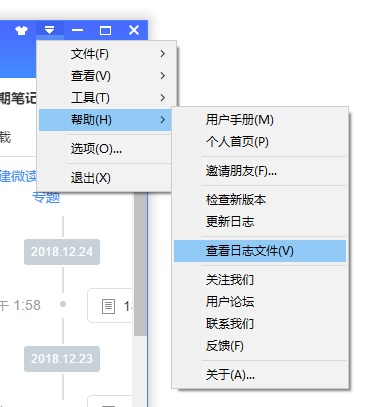

# 为知笔记备份插件
## 简介
官方的备份功能需要先下载所有笔记到本地(不然未下载的笔记在备份压缩包里都是空文件)，而这个下载过程非常耗时，下载完后也没有统计信息告知下载情况。为知笔记备份插件(WizBackup)的初衷就是为了解决这个问题。插件逻辑非常简单，遍历所有文档，调用'CheckDocumentData' API，依次下载文档，并统计下载信息。

## 说明
1. 因为官方的API文档比较简单，网上也没有较详细的开发资料，所以这个简单的插件能跑通也是摸索出来的，没有经过完整的测试，不建议直接使用，仅作为参考。
2. `在plugin.ini文件的[Common]区段下添加字段“SupportVersion”，此字段值大于等于2的情况下，4.5以及之后版本启动时会加载此插件。`参考[适用于为知笔记Windows客户端4.5版本的插件开发API文档](http://www.wiz.cn/plugin-api-document-45.html)。少了这个字段，程序不会加载该插件，日志文件会记录“No support WizPlugin 2”。
3. CheckDocumentData API 需要传入一个参数，否则不能正常工作，返回null，也不会报错。但官方并没有说明应该传什么参数，经本人尝试，传入0即可正常工作，但并没有经过大规模验证。
4. 调试插件时可以查看程序日志文件，如下图所示。

。

5. 启动为知笔记时加入调试参数，插件运行出错时会报错。如下图所示。

## 参考文档
[官方API](http://www.wiz.cn/manual/plugin/index.html)